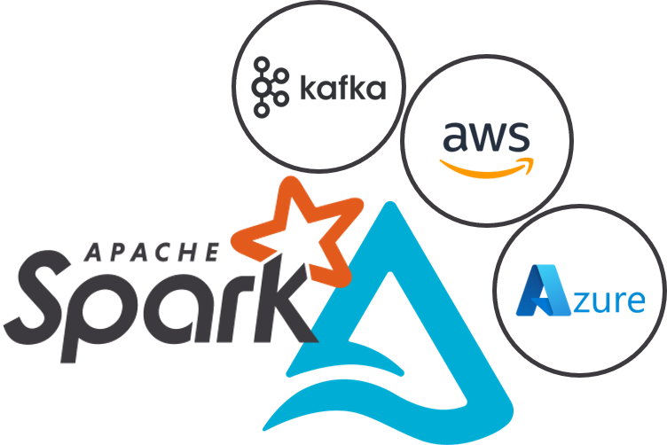

<p align="center"></p>
<h1 align="center"> Spark + Delta Standalone Docker</h1>
<p align="center">
  <a href="https://github.com/marcelomendoncasoares/spark-delta-standalone-docker">
    
  </a>
  <a href="https://github.com/marcelomendoncasoares/spark-delta-standalone-docker/actions/workflows/build_and_publish.yml">
    
  </a>
  <a href="https://hub.docker.com/r/marcelomendoncasoares/spark-delta-standalone/">
    
  </a>
  <a href="http://www.apache.org/licenses/LICENSE-2.0.html">
    
  </a>
</p>

Base image that extends the official Apache Spark image available at the
[Apache Docker Hub](hhttps://hub.docker.com/r/apache/spark) and allows easy
provisioning of a standalone cluster. By setting the `START_SPARK_CLUSTER`
environment variable to `true`, the container will start the master, worker and
executors upon initialization, according to the configuration provided by
environment variables. To know all configuration options regarding cores and
memory usage, check the [Configuring the cluster](#configuring-the-cluster)
section.

In this image, any Spark application will automatically use `delta` as default
file format for `load/save` operations, and as table catalog. Bear in mind that
the dependencies provision can take a while on the first run, but it will be
cached for future runs. So, in case of dispatching multiple jobs, it is
recommended to start the container and reuse it for all jobs. It also contains
other cloud connectors, such as Apache Kafka, Amazon S3, AWS Kinesis, Azure
Blob Storage and Azure Eventhubs that can be enabled by setting the
`EXTRA_CLOUD_JARS` env var.

> If needed, the image provides the Spark and delta versions available through
> the environment variables `SPARK_VERSION` and `DELTA_VERSION`, respectively.

- [Starting the cluster](#starting-the-cluster)
- [Configuring the cluster](#configuring-the-cluster)
- [Starting from docker-compose file](#starting-from-docker-compose-file)
- [Using Pyspark to connect to the cluster](#using-pyspark-to-connect-to-the-cluster)
- [Building](#building)
- [License](#license)

## Starting the cluster

As the cluster is contained inside a single container, it can be started
directly with `docker run`, by simply running:

```bash
docker run -i --rm \
    -p 4040:4040 -p 7077:7077 -p 8080:8080 -p 8081:8081 \
    -e START_SPARK_CLUSTER=true \
    -e EXTRA_CLOUD_JARS=true \
    -t marcelomendoncasoares/spark-delta-standalone:latest
```

And thats it! The cluster is ready for usage. The master and worker processes
can be inspected by running:

```bash
root@4ebdfdcc1562:~# ps -ax | grep java
 19 pts/0    Sl     0:05 /opt/java/openjdk/bin/java -cp /opt/spark/conf/:/opt/spark/jars/* -Xmx1g org.apache.spark.deploy.master.Master --host 8f7f7bb5d931 --port 7077 --webui-port 8080
290 pts/0    Sl     0:05 /opt/java/openjdk/bin/java -cp /opt/spark/conf/:/opt/spark/jars/* -Xmx1g org.apache.spark.deploy.worker.Worker --webui-port 8081 spark://0.0.0.0:7077
363 pts/0    S+     0:00 grep --color=auto java
```

To test a job execution, run the example jar:

```bash
# The `$SPARK_HOME/bin` folder is already in the `$PATH` env var. Note that for
# submitting a job from within the container, the master IP is `0.0.0.0` and
# not `localhost`.
spark-submit \
    --master spark://0.0.0.0:7077 \
    --class org.apache.spark.examples.SparkPi \
    /opt/spark/examples/jars/spark-examples_2.12.jar
```

> In the first call, all jar dependencies will be downloaded and provided to
> the session. This can take a while, but only in the first run, as it will be
> cached for future runs.

## Configuring the cluster

To make the container a single node standalone cluster, simply start it with
the `START_SPARK_CLUSTER` environment variable set to `true`. The cluster will
contain a master and one worker with several executors, as is recommended by
Spark documentation (https://issues.apache.org/jira/browse/SPARK-30978).

The worker memory and cores will default to the sum of the configured memory
and cores for all executors, so it does not need to be directly configured. The
following environment variables can be used to configure the cluster:

    - FREE_CORES: Default: '1'
        Number of cores to be left free for the OS or other apps.

    - DRIVER_CORES: Default: '1'
        Number of cores to be used by the driver.

    - MIN_EXECUTOR_CORES: Default: '1'
        Minimum number of cores to be used by each executor. The actual number
        of cores used by each executor will be the minimum between this value
        and the number of cores available divided by the number of executors.

    - FREE_MEMORY: Default: '10%, 1GB' (the "GB" symbol is required)
        Memory to be left free for the OS or other apps. Can be provided in one
        of the following formats:
            * Percentage only: "10%" or "0.1"
            * Percentage and minimum value in GB: "10%, 1GB"
            * Exact value in GB: "1GB"

    - DRIVER_MEMORY: Default: '10%, 1GB'
        Percentage of memory to be used by the driver. Same format and
        specification possibilities as `FREE_MEMORY`.

    - EXECUTOR_MEMORY: Default: '16GB'
        Memory to be used by each executor. Will divide the available memory to
        calculate the number of executors, if `NUM_EXECUTORS` is not provided.
        Only the exact value in GB is accepted and the "GB" symbol is required.

    - NUM_EXECUTORS: Default: '0'
        Number of executors to be started. If < 1, will determine the number of
        executors will be calculated based on the available memory and the
        memory to be used by each executor.

    - AUTO_SCALE: Default: 'true'
        Whether to enable the Spark 'dynamic allocation' feature. If enabled,
        the number of executors will start from `NUM_EXECUTORS` and use this as
        maximum after scaling down and up according to the workload. Other
        executor configs (memory and cores) will still be respected when
        spawning new executors during scale up.

All configuration is optional. If no configuration is provided, the cluster
will be started with the default configurations.

> Note that, beside all memory configurations requiring the `GB` symbol, _it is
> not possible to use other units besides GB_.

Additionally to the cluster configuration, the following environment variables
can also be used to configure extra jars usage for the cluster:

    - EXTRA_CLOUD_JARS: Default: Not set
        Add extra cloud jars to the cluster to connect to Apache Kafka, Amazon
        S3, AWS Kinesis, Azure Blob Storage and Azure Eventhubs. Can either be
        `true` to add all jars, `azure` to include azure-related jars or
        `aws` to include aws-related jars. If not set or `false`, no extra
        jars will be added. Apache Kafka will be present in all positive cases.

    - EXTRA_JARS_PACKAGES: Default: Not set
        Comma separated list of extra cloud jars to be used by the cluster. The
        jars will be downloaded from the Maven repository upon first run, in
        addition to delta and other cloud jars, if configured.

## Starting from docker-compose file

The repository contains an example of starting the cluster from
[`docker-compose.yml`](docker-compose.yml), together with a client that will
submit a job to compute the `pi` number. To run it, just do:

```bash
docker-compose up
```

After the cluster is up, it will be available to the host machine for any other
`SparkSession` at `localhost:7077` that can be accessed by any SparkSession.
All submitted jobs can be observed in the [Spark UI](http://localhost:8080).

> It is also possible to use this image to create a standalone cluster with
> master and worker in separate containers, or to create a real cluster, as
> shown in [manual-cluster-example](manual-cluster-example/docker-compose.yml).
> For a standalone cluster, however, this option loses the convenience provided
> by the environment variables for dynamically configuring the cluster based on
> the host cores and memory.

## Using Pyspark to connect to the cluster

After starting the cluster using any of the above methods, the `master` will be
accessible by the host machine at `localhost:7077`. To connect from any
`pyspark` running on the host or other container, just start its `SparkSession`
like the following:

```python
from delta import configure_spark_with_delta_pip
from pyspark.sql import SparkSession

# It is needed to provide the delta jar on the session as well. Be sure to
# first `pip install pyspark delta-spark` with the corresponding versions as
# the ones used on the cluster.
spark = (
    configure_spark_with_delta_pip(
        SparkSession.builder
        .appName("test")
        .master("spark://localhost:7077")
    )
    .getOrCreate()
)

spark.range(1, 100).write.format("delta").save("delta_table")
spark.read.load("delta_table").show()
spark.sql("drop table delta_table")
```

## Building

To build the image, run the following command:

```bash
docker build -t marcelomendoncasoares/spark-delta-standalone --build-arg SPARK_VERSION="3.3.3" .
```

The build argument `SPARK_VERSION` is optional and will defaults to `latest` if
not provided, which will use the latest Spark version available at the official
Apache Spark Docker Hub. This option is useful to target a specific Spark
version (with its compatible delta version).

> The image was developed and tested with Spark greater than 3.0.0. If using
> Spark 2.x, it is possible that the build fails due to `delta` version
> incompatibilities.

---

## License

Copyright &copy; 2023 Marcelo Soares.

Licensed under the
[Apache License, Version 2.0](http://www.apache.org/licenses/LICENSE-2.0).
